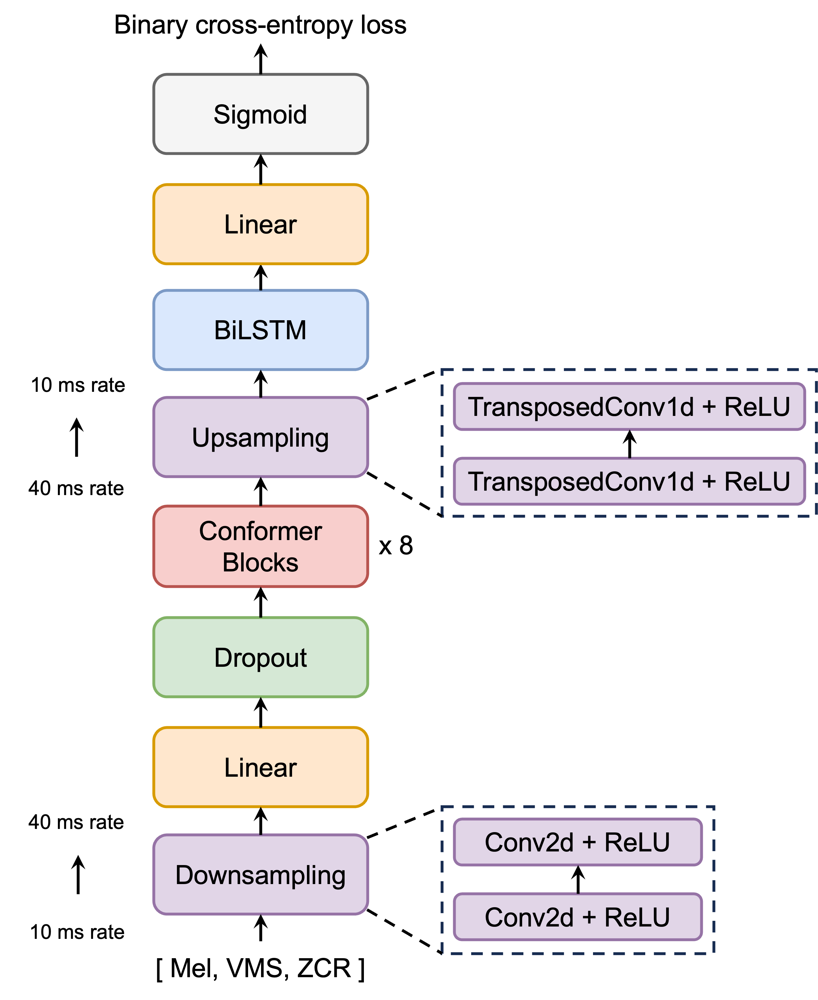

# **Respiro-en**

Official PyTorch implementation of the paper: \
**Frame-Wise Breath Detection with Self-Training: An Exploration of Enhancing Breath Naturalness in Text-to-Speech**, ***INTERSPEECH 2024***.

<a href='https://arxiv.org/abs/2402.00288'></a>
<a href='https://ydqmkkx.github.io/breath-detection/'></a>
<!-- <a href='https://huggingface.co/DongYANG/Respiro-en'></a> -->

## Introduction

This model is developed for detecting the positions of breath sounds in speech utterances. \
It was trained using **[LibriTTS-R](https://arxiv.org/abs/2305.18802)** corpus.




## Environment
The version requirements for Python libraries are not strict, only `torch` and `torchaudio` need to be above version 2.0. 
Our configuration:
```
torch == 2.2.2
torchaudio == 2.2.2
librosa == 0.10.0
numpy == 1.23.0
intervaltree == 3.1.0
```


## Get Started (detailed)

```python
import torch
import librosa
import numpy as np
from modules import feature_extractor, DetectionNet

# model loading
device = torch.device("cuda" if torch.cuda.is_available() else "cpu")
model = DetectionNet().to(device)
checkpoint = torch.load("respiro-en.pt")
model.load_state_dict(checkpoint["model"])
model.eval()

# Examples. These files are from LibriTTS-R corpus
wav_path = "samples/train-clean-100_19_198_000010_000003.wav"
#wav_path = "samples/train-clean-360_14_208_000001_000000.wav"
#wav_path = "samples/train-other-500_20_205_000002_000002.wav"
wav, sr = librosa.load(wav_path, sr=16000)
feature, length = feature_extractor(wav)
feature, length = feature.to(device), length.to(device)
output = model(feature, length)

# 0.064 is the threshold obtained from our validation set
# You can try more strict thresholds like 0.5 or 0.9
threshold = 0.064

# min_length: length threshold to avoid too short detected breath, which tends to be the end part of speech
# default: 20 ms
min_length = 20

prediction = (output[0] > 0.064).nonzero().squeeze().tolist()
if isinstance(prediction, list) and len(prediction)>1:
    diffs = np.diff(prediction)
    splits = np.where(diffs != 1)[0] + 1
    splits = np.split(prediction, splits)
    splits = list(filter(lambda split: len(split)>min_length, splits))
    if len(splits)>1:
        for split in splits:
            print(split)
# The segments of breath are printed
# 229 means 229 ms
'''
output:
[229 230 231 232 233 234 235 236 237 238 239 240 241 242 243 244 245 246
 247 248 249 250 251 252 253 254 255 256 257 258 259 260 261 262 263 264
 265 266 267 268 269 270 271 272 273 274 275 276 277 278 279 280 281]
[811 812 813 814 815 816 817 818 819 820 821 822 823 824 825 826 827 828
 829 830 831 832 833 834 835 836]
'''
```
You can listen to the detected parts:
```python
start = splits[0][0]
end = splits[0][-1]

from IPython.display import Audio
Audio(data=wav[int((start*0.01)*sr):int((end*0.01)*sr)], rate=sr) 
```


## Get Started (quick)
We have assembled the above detection process into `BreathDetector` for ease of use:
```python
import torch
from modules import DetectionNet, BreathDetector

device = torch.device("cuda" if torch.cuda.is_available() else "cpu")
model = DetectionNet().to(device)
checkpoint = torch.load("respiro-en.pt")
model.load_state_dict(checkpoint["model"])
model.eval()

detector = BreathDetector(model) # Args: model, device=None

wav_path = "samples/train-clean-100_19_198_000010_000003.wav"
tree = detector(wav_path) # Args: wav_path, threshold=0.064, min_length=20
print(tree)
'''
output:
IntervalTree([Interval(2.29, 2.81), Interval(8.11, 8.36)])
'''
```
We used `IntervalTree`, which can identify overlapping segments in the tree with a given interval:
```python
print(tree[2.6:5.2])
'''
output:
{Interval(2.29, 2.81)}
'''
```
The `IntervalTree` can be converted into a list:
```python
print(sorted(tree))
'''
output:
[Interval(2.29, 2.81), Interval(8.11, 8.36)]
'''
```
